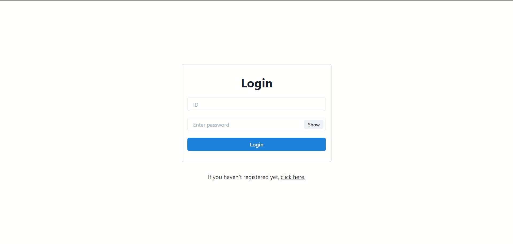
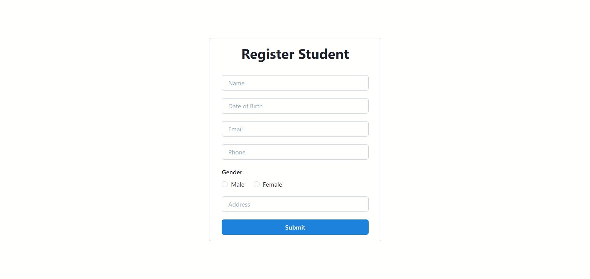
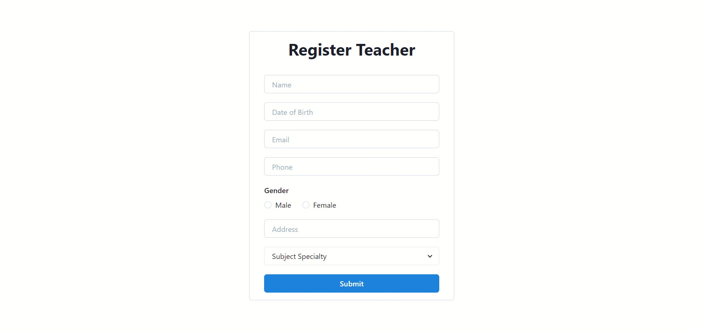
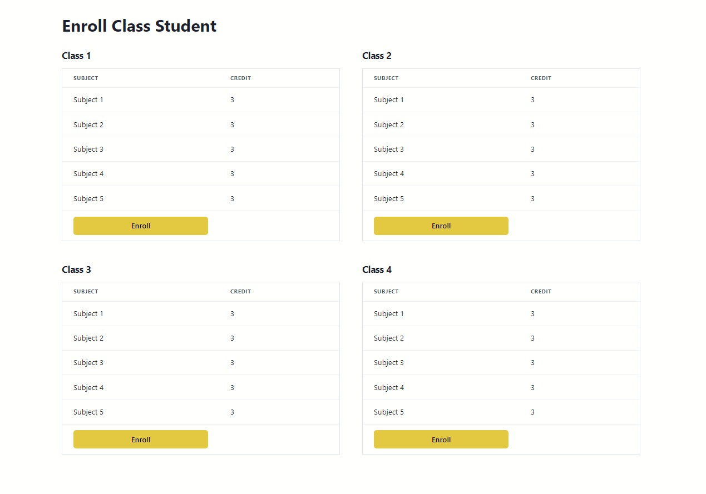
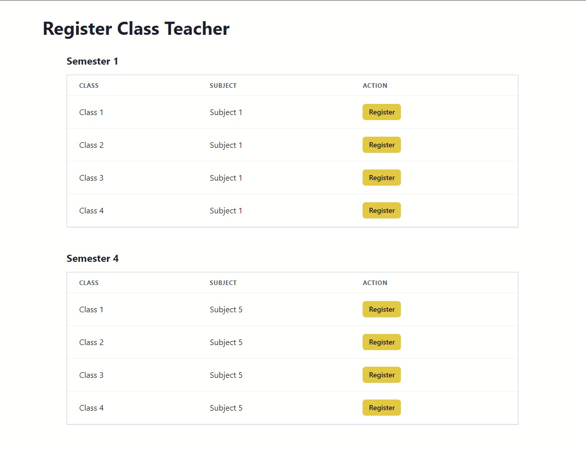
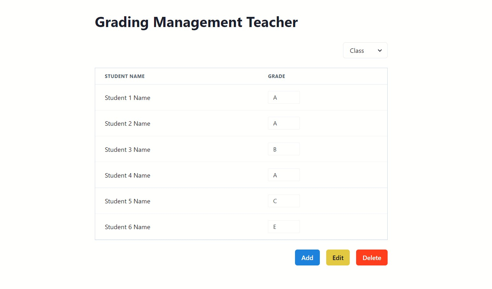
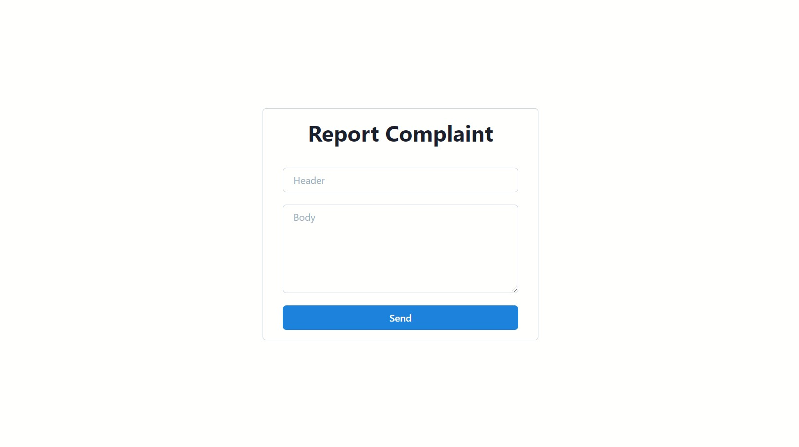
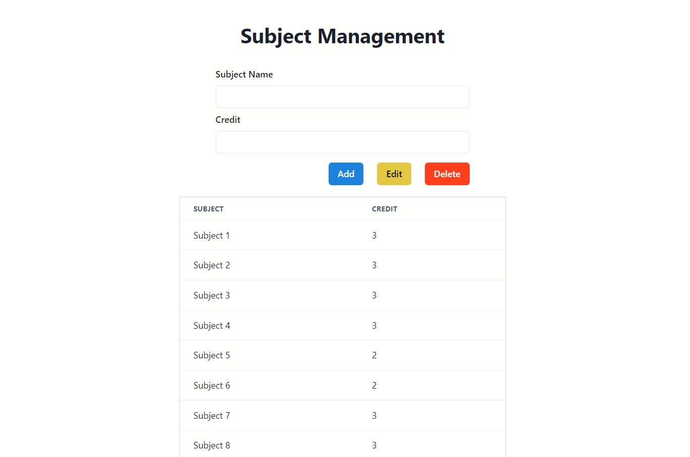

## Software Engineering Subject Final Project

This is a simple web application for our software engineering final project. I build this app with [Next.js](https://nextjs.org/) and [Chakra UI](https://chakra-ui.com/) for the frontend and Go with [Fiber](https://gofiber.io/) for the backend.

### Login form

### Student registration form

### Teacher registration form

### Enroll class student

### Register class teacher

### Grading management teacher

### Report complaint

### Subject management

